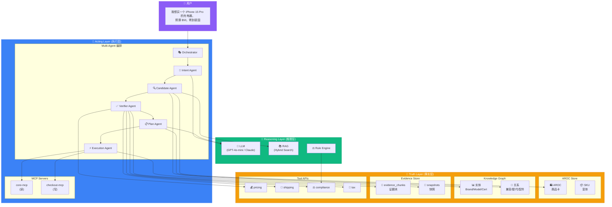
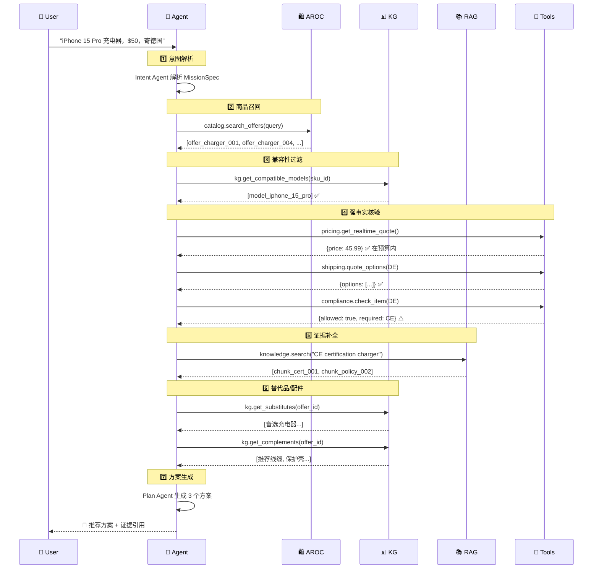
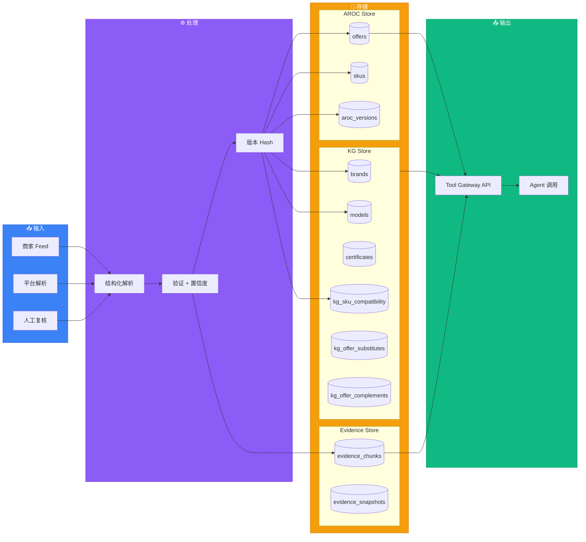
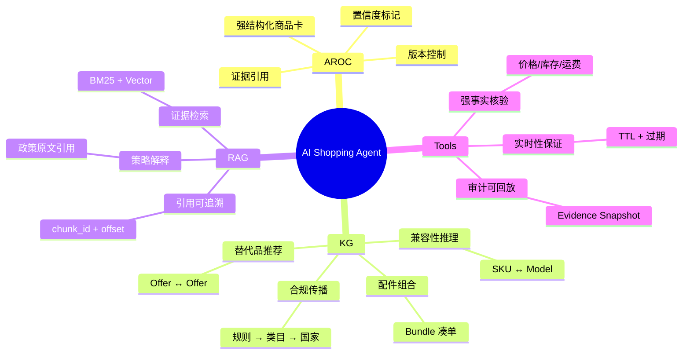

# 系统架构总览

> 三层架构：Truth Layer → Reasoning Layer → Acting Layer

## 整体架构

```mermaid
flowchart TB
    subgraph User["👤 用户"]
        Query["我想买一个 iPhone 15 Pro 的充电器，\n预算 $50，寄到德国"]
    end
    
    subgraph Acting["🎯 Acting Layer (执行层)"]
        subgraph Agents["Multi-Agent 编排"]
            Orchestrator["🎭 Orchestrator"]
            Intent["💭 Intent Agent"]
            Candidate["🔍 Candidate Agent"]
            Verifier["✅ Verifier Agent"]
            Plan["📋 Plan Agent"]
            Execution["⚡ Execution Agent"]
        end
        
        subgraph MCP["MCP Servers"]
            CoreMCP["core-mcp\n(读)"]
            CheckoutMCP["checkout-mcp\n(写)"]
        end
    end
    
    subgraph Reasoning["🧠 Reasoning Layer (推理层)"]
        LLM["🤖 LLM\n(GPT-4o-mini / Claude)"]
        RAG["📚 RAG\n(Hybrid Search)"]
        RuleEngine["⚖️ Rule Engine"]
    end
    
    subgraph Truth["💎 Truth Layer (事实层)"]
        subgraph AROC_Store["AROC Store"]
            AROC["🛍️ AROC\n商品卡"]
            SKU["📦 SKU\n变体"]
        end
        
        subgraph KG_Store["Knowledge Graph"]
            KG_Nodes["📊 实体\nBrand/Model/Cert"]
            KG_Edges["🔗 关系\n兼容/替代/配件"]
        end
        
        subgraph Evidence_Store["Evidence Store"]
            Chunks["📝 evidence_chunks\n证据块"]
            Snapshots["📸 snapshots\n快照"]
        end
        
        subgraph Tools["Tool APIs"]
            Pricing["💰 pricing"]
            Shipping["🚚 shipping"]
            Compliance["⚖️ compliance"]
            Tax["🧾 tax"]
        end
    end
    
    User --> Orchestrator
    Orchestrator --> Intent
    Intent --> LLM
    Intent --> Candidate
    
    Candidate --> AROC
    Candidate --> KG_Nodes
    Candidate --> RAG
    
    Candidate --> Verifier
    Verifier --> Pricing
    Verifier --> Shipping
    Verifier --> Compliance
    Verifier --> Tax
    Verifier --> Chunks
    
    Verifier --> Plan
    Plan --> LLM
    Plan --> KG_Edges
    
    Plan --> Execution
    Execution --> CoreMCP
    Execution --> CheckoutMCP
    Execution --> Snapshots
    
    RuleEngine --> Compliance
    
    style User fill:#8b5cf6,stroke:#7c3aed,color:#fff
    style Acting fill:#3b82f6,stroke:#2563eb,color:#fff
    style Reasoning fill:#10b981,stroke:#059669,color:#fff
    style Truth fill:#f59e0b,stroke:#d97706,color:#fff
```

---

## AROC + KG + RAG 协作流程

```mermaid
sequenceDiagram
    participant User as 👤 User
    participant Agent as 🤖 Agent
    participant AROC as 🛍️ AROC
    participant KG as 📊 KG
    participant RAG as 📚 RAG
    participant Tools as 🔧 Tools
    
    User->>Agent: "iPhone 15 Pro 充电器，$50，寄德国"
    
    Note over Agent: 1️⃣ 意图解析
    Agent->>Agent: Intent Agent 解析 MissionSpec
    
    Note over Agent,AROC: 2️⃣ 商品召回
    Agent->>AROC: catalog.search_offers(query)
    AROC-->>Agent: [offer_charger_001, offer_charger_004, ...]
    
    Note over Agent,KG: 3️⃣ 兼容性过滤
    Agent->>KG: kg.get_compatible_models(sku_id)
    KG-->>Agent: [model_iphone_15_pro] ✅
    
    Note over Agent,Tools: 4️⃣ 强事实核验
    Agent->>Tools: pricing.get_realtime_quote()
    Tools-->>Agent: {price: 45.99} ✅ 在预算内
    
    Agent->>Tools: shipping.quote_options(DE)
    Tools-->>Agent: {options: [...]} ✅
    
    Agent->>Tools: compliance.check_item(DE)
    Tools-->>Agent: {allowed: true, required: CE} ⚠️
    
    Note over Agent,RAG: 5️⃣ 证据补全
    Agent->>RAG: knowledge.search("CE certification charger")
    RAG-->>Agent: [chunk_cert_001, chunk_policy_002]
    
    Note over Agent,KG: 6️⃣ 替代品/配件
    Agent->>KG: kg.get_substitutes(offer_id)
    KG-->>Agent: [备选充电器...]
    
    Agent->>KG: kg.get_complements(offer_id)
    KG-->>Agent: [推荐线缆, 保护壳...]
    
    Note over Agent: 7️⃣ 方案生成
    Agent->>Agent: Plan Agent 生成 3 个方案
    
    Agent-->>User: 🎯 推荐方案 + 证据引用
```

---

## 数据流转

```mermaid
flowchart LR
    subgraph Input["📥 输入"]
        MerchantFeed["商家 Feed"]
        Platform["平台解析"]
        Manual["人工复核"]
    end
    
    subgraph Processing["⚙️ 处理"]
        Parse["结构化解析"]
        Validate["验证 + 置信度"]
        Hash["版本 Hash"]
    end
    
    subgraph Storage["💾 存储"]
        subgraph AROC_DB["AROC Store"]
            Offers[(offers)]
            SKUs[(skus)]
            Versions[(aroc_versions)]
        end
        
        subgraph KG_DB["KG Store"]
            Brands[(brands)]
            Models[(models)]
            Certs[(certificates)]
            Compat[(kg_sku_compatibility)]
            Subst[(kg_offer_substitutes)]
            Compl[(kg_offer_complements)]
        end
        
        subgraph RAG_DB["Evidence Store"]
            Chunks[(evidence_chunks)]
            Snaps[(evidence_snapshots)]
        end
    end
    
    subgraph Output["📤 输出"]
        API["Tool Gateway API"]
        Agent["Agent 调用"]
    end
    
    MerchantFeed --> Parse
    Platform --> Parse
    Manual --> Parse
    
    Parse --> Validate
    Validate --> Hash
    
    Hash --> Offers
    Hash --> SKUs
    Hash --> Versions
    
    Hash --> Brands
    Hash --> Models
    Hash --> Compat
    
    Validate --> Chunks
    
    Offers --> API
    KG_DB --> API
    Chunks --> API
    
    API --> Agent
    
    style Input fill:#3b82f6,stroke:#2563eb,color:#fff
    style Processing fill:#8b5cf6,stroke:#7c3aed,color:#fff
    style Storage fill:#f59e0b,stroke:#d97706,color:#fff
    style Output fill:#10b981,stroke:#059669,color:#fff
```

---

## 核心价值

```mermaid
mindmap
    root((AI Shopping Agent))
        AROC
            强结构化商品卡
            版本控制
            证据引用
            置信度标记
        KG
            兼容性推理
                SKU ↔ Model
            替代品推荐
                Offer ↔ Offer
            配件组合
                Bundle 凑单
            合规传播
                规则 → 类目 → 国家
        RAG
            证据检索
                BM25 + Vector
            引用可追溯
                chunk_id + offset
            策略解释
                政策原文引用
        Tools
            强事实核验
                价格/库存/运费
            实时性保证
                TTL + 过期
            审计可回放
                Evidence Snapshot
```

