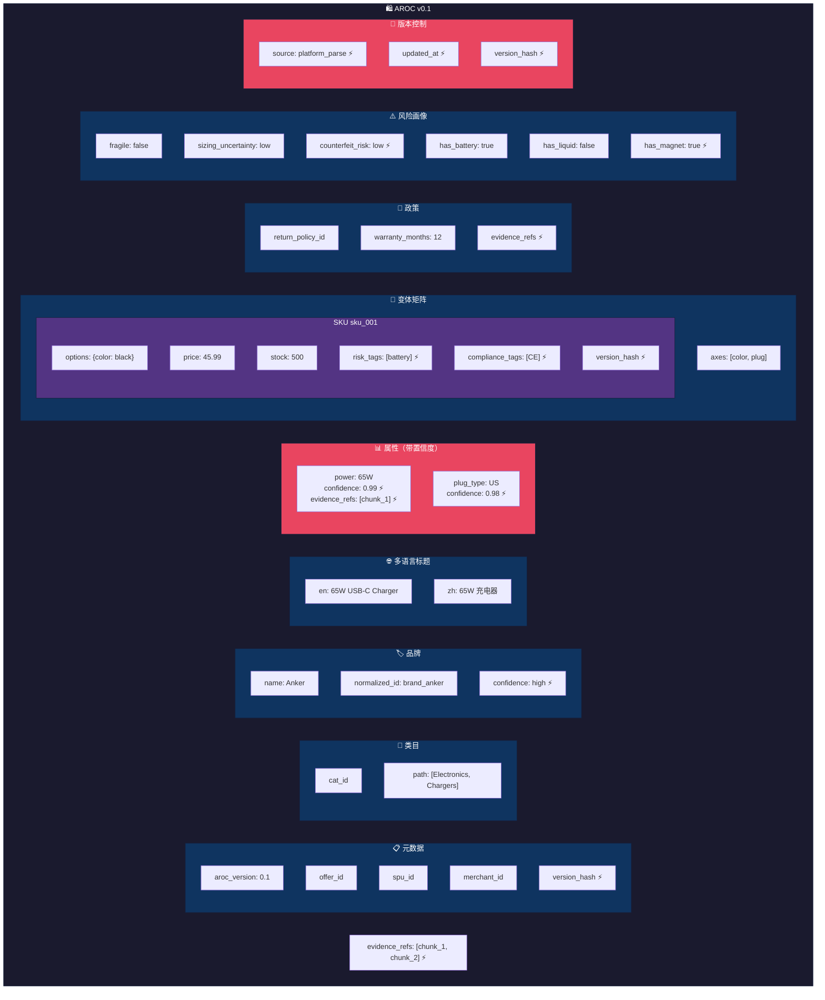
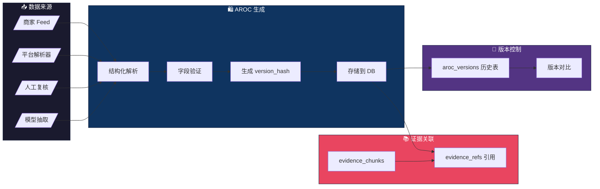
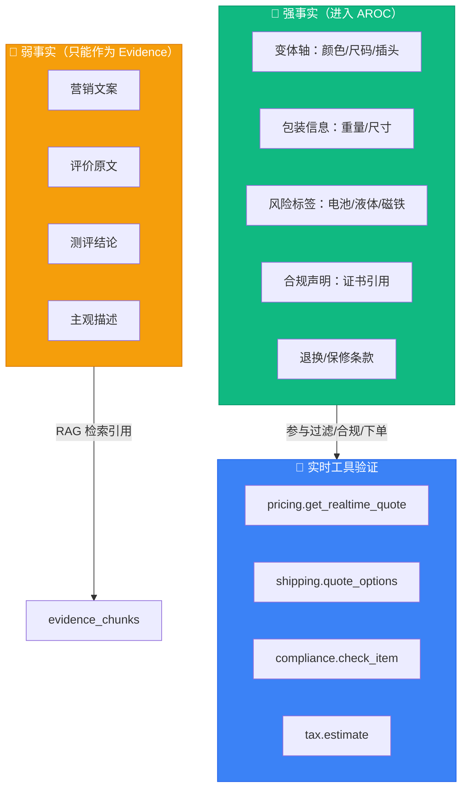

# AROC (AI-Ready Offer Card) 结构图

> AI 读取商品信息的唯一结构化入口

## AROC 结构概览

```mermaid
graph TB
    subgraph AROC["🛍️ AROC v0.1"]
        subgraph Meta["📋 元数据"]
            aroc_version["aroc_version: 0.1"]
            offer_id["offer_id"]
            spu_id["spu_id"]
            merchant_id["merchant_id"]
            version_hash["version_hash ⚡"]
        end
        
        subgraph Category["📁 类目"]
            cat_id["cat_id"]
            cat_path["path: [Electronics, Chargers]"]
        end
        
        subgraph Brand["🏷️ 品牌"]
            brand_name["name: Anker"]
            brand_id["normalized_id: brand_anker"]
            brand_conf["confidence: high ⚡"]
        end
        
        subgraph Titles["🌐 多语言标题"]
            title_en["en: 65W USB-C Charger"]
            title_zh["zh: 65W 充电器"]
        end
        
        subgraph Attributes["📊 属性（带置信度）"]
            attr1["power: 65W\nconfidence: 0.99 ⚡\nevidence_refs: [chunk_1] ⚡"]
            attr2["plug_type: US\nconfidence: 0.98 ⚡"]
        end
        
        subgraph Variants["🎨 变体矩阵"]
            axes["axes: [color, plug]"]
            subgraph SKU1["SKU sku_001"]
                sku_opts["options: {color: black}"]
                sku_price["price: 45.99"]
                sku_stock["stock: 500"]
                sku_risk["risk_tags: [battery] ⚡"]
                sku_comp["compliance_tags: [CE] ⚡"]
                sku_ver["version_hash ⚡"]
            end
        end
        
        subgraph Policies["📜 政策"]
            return_policy["return_policy_id"]
            warranty["warranty_months: 12"]
            policy_refs["evidence_refs ⚡"]
        end
        
        subgraph Risk["⚠️ 风险画像"]
            fragile["fragile: false"]
            sizing["sizing_uncertainty: low"]
            counterfeit["counterfeit_risk: low ⚡"]
            battery["has_battery: true"]
            liquid["has_liquid: false"]
            magnet["has_magnet: true ⚡"]
        end
        
        subgraph Update["🔄 版本控制"]
            source["source: platform_parse ⚡"]
            updated_at["updated_at ⚡"]
            hash["version_hash ⚡"]
        end
        
        evidence_refs["evidence_refs: [chunk_1, chunk_2] ⚡"]
    end
    
    style AROC fill:#1a1a2e,stroke:#16213e,color:#fff
    style Meta fill:#0f3460,stroke:#16213e,color:#fff
    style Category fill:#0f3460,stroke:#16213e,color:#fff
    style Brand fill:#0f3460,stroke:#16213e,color:#fff
    style Titles fill:#0f3460,stroke:#16213e,color:#fff
    style Attributes fill:#e94560,stroke:#16213e,color:#fff
    style Variants fill:#0f3460,stroke:#16213e,color:#fff
    style SKU1 fill:#533483,stroke:#16213e,color:#fff
    style Policies fill:#0f3460,stroke:#16213e,color:#fff
    style Risk fill:#0f3460,stroke:#16213e,color:#fff
    style Update fill:#e94560,stroke:#16213e,color:#fff
```

> ⚡ 标记的字段为本次新增的完善字段

---

## AROC 数据流

```mermaid
flowchart LR
    subgraph Sources["📥 数据来源"]
        MF[/"商家 Feed"/]
        PP[/"平台解析器"/]
        HR[/"人工复核"/]
        ML[/"模型抽取"/]
    end
    
    subgraph AROC["🛍️ AROC 生成"]
        Parse["结构化解析"]
        Validate["字段验证"]
        Hash["生成 version_hash"]
        Store["存储到 DB"]
    end
    
    subgraph Evidence["📚 证据关联"]
        Chunks["evidence_chunks"]
        Refs["evidence_refs 引用"]
    end
    
    subgraph Versioning["🔄 版本控制"]
        History["aroc_versions 历史表"]
        Diff["版本对比"]
    end
    
    MF --> Parse
    PP --> Parse
    HR --> Parse
    ML --> Parse
    
    Parse --> Validate
    Validate --> Hash
    Hash --> Store
    
    Store --> Refs
    Chunks --> Refs
    
    Store --> History
    History --> Diff
    
    style Sources fill:#1a1a2e,stroke:#16213e,color:#fff
    style AROC fill:#0f3460,stroke:#16213e,color:#fff
    style Evidence fill:#e94560,stroke:#16213e,color:#fff
    style Versioning fill:#533483,stroke:#16213e,color:#fff
```

---

## 强事实 vs 弱事实

```mermaid
graph TB
    subgraph Strong["💪 强事实（进入 AROC）"]
        S1["变体轴：颜色/尺码/插头"]
        S2["包装信息：重量/尺寸"]
        S3["风险标签：电池/液体/磁铁"]
        S4["合规声明：证书引用"]
        S5["退换/保修条款"]
    end
    
    subgraph Weak["📝 弱事实（只能作为 Evidence）"]
        W1["营销文案"]
        W2["评价原文"]
        W3["测评结论"]
        W4["主观描述"]
    end
    
    subgraph Tools["🔧 实时工具验证"]
        T1["pricing.get_realtime_quote"]
        T2["shipping.quote_options"]
        T3["compliance.check_item"]
        T4["tax.estimate"]
    end
    
    Strong --> |"参与过滤/合规/下单"| Tools
    Weak --> |"RAG 检索引用"| Evidence["evidence_chunks"]
    
    style Strong fill:#10b981,stroke:#059669,color:#fff
    style Weak fill:#f59e0b,stroke:#d97706,color:#fff
    style Tools fill:#3b82f6,stroke:#2563eb,color:#fff
```

