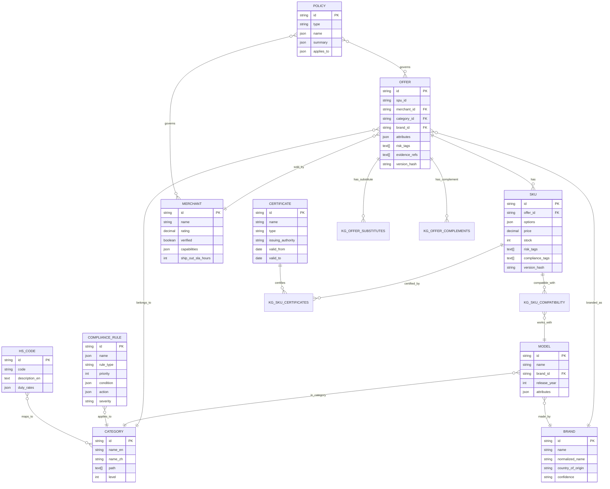
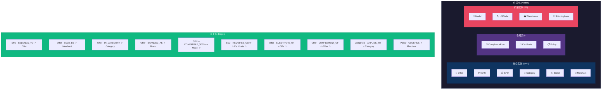
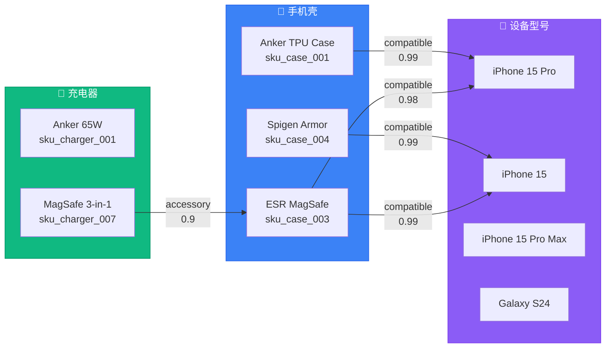
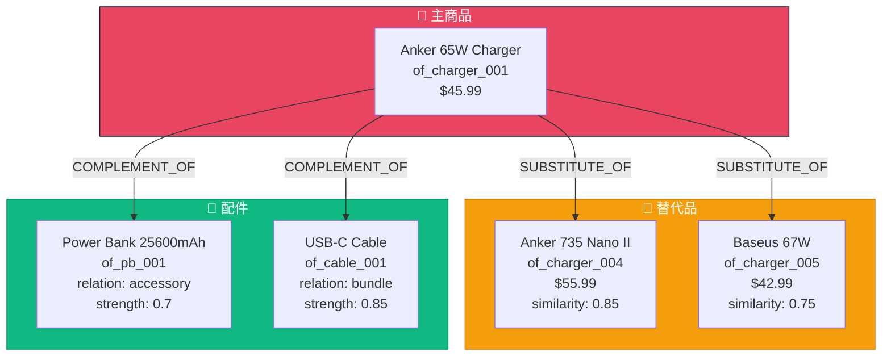
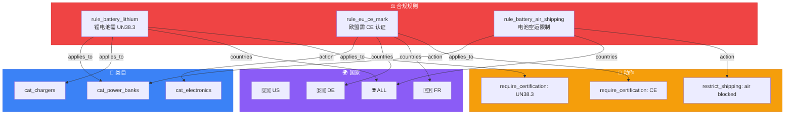
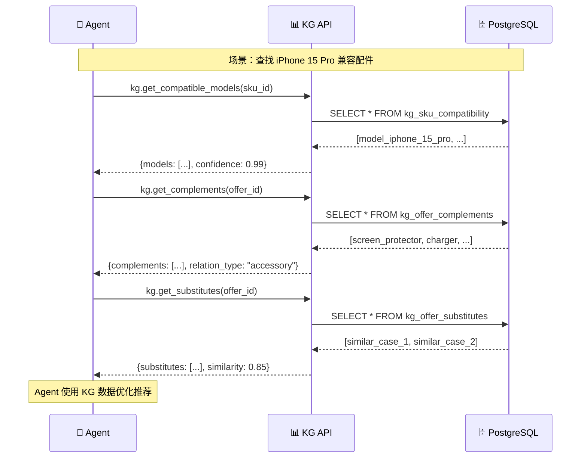
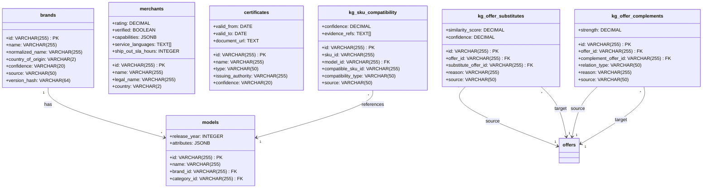

# 知识图谱 (Knowledge Graph) 架构图

> 解决综合类目"属性不统一 + 兼容关系复杂"的核心方案

## 实体关系总览 (ERD)

---

## 知识图谱节点与边

> ✨ 标记的关系为本次新增

---

## 兼容性关系图示

---

## 替代品与配件关系

---

## 合规规则传播

---

## KG 服务化调用流程

---

## 数据库表结构

